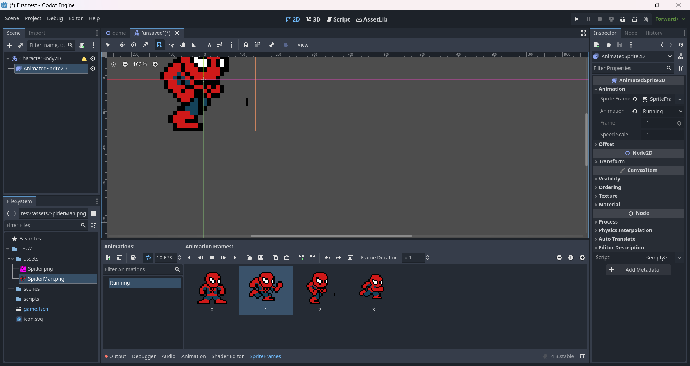

# Entry 1
##### 10/28/24

### For this years freedom project I've decided to use Godot, a free 2D and 3D open source game engine. I chose Godot because last year I also chose a tool that could also make games but when it came to animation it got more complex on how to properly use it so I'm excited to see if the animation for Godot is any better. I am planning to make a fighting style game similar to game I used to play when I was younger called "The Fight for Glorton". Playing it again I realized it takes a lot of inspiration from "Super Smash Bros". I plan on making at least two or three different characters with different abilities just like in the original game. For the first time tinkering with Godot I was surprised to see that Godot is very similar to Kaboom.js. They both start off with a scene that can be reused as many times as you want. Unlike in Kaboom where scenes only hold the levels that you create a scene in Godot can hold anything, from a coin that can be used repeatedly to a whole entire level.

## Tinkering

### I spent most of my tinkering on the [Godot documentation](https://docs.godotengine.org/en/stable/getting_started/introduction/index.html) learning waht it can really do and spotting similarities and differences it has with Kaboom.Like how Godot uses a different naming convention when writing in their GDscript for classes. It uses PascalCase for classes, snake_case for variables and ALL_CAPS for constants. After downloading onto my laptop I went ahead and searched up a [video](https://youtu.be/LOhfqjmasi0?si=97RQQAm9aia7c_2w) on how to get started learning Godot because I find it easier to learn when wathcing a video walking me through the pross of creating an example product. I didn't go so far ahead into the video put I was really eager to learn how the animation works for Godot so thats what I checked for first. After openeing up Godot you create a new project and give it a name. Then you are able to create a node which are essential to making your game as nodes as everything in Godot when making a game is made up of nodes. There can also be many types of nodes. Sone can be to display a sprite and others can be an audio that is played. A cool thing about nodes is that they can be enhanced by existing nodes to be more powerful. When starting to make your game you start out with a blank slate so it's important to create folders to hold all your future game assets. For my mini example I made a folder called assets and imported a Spider-Man spread sheet to try out the animation as it's what I was most excited for. What I liked better for Godot seperating the spread sheet compared to Kaboom is that you can see where in the spread sheet the sprites are being sliced. Kaboom's seperatation slices weren't always accurate but in Godot at least you could make minor changes so that your spread sheet could match the sprite you want. To seperate a sprite spread sheet you have to specify how many cuts you want on the spread sheet going horizontally and vertically. After getting your desired cuts you select the sprites in order of selection of the certain animation you want. The first time I attempted this it fit only some of the sprites but not all of them. But the you don't need to have all the sprites so after You could rearrange the slices so that a specific few of the sprites do fit and can be selected. I managed to get my example sprite to move in a running animation. Im so glad its simpler to do than on Kaboom.

### For the enginering design process I am still researching my tool but with how straight forward learning animation was I hope learning what else Godot has to offer is just as rewarding.

#### Skills
* Find what works for you: I have found that for me I learn better when someone is walking me through a small example which is why I search up a video and made my own personal rendition of the project
* Try things out: In the video when he slices his spread sheet his sprite was cut perfectly however mine on the other hand was not so looking at the other settings other than the slicers there were other options to fix your spread sheet until the your sprite fits that the video didn't go over.

[Next](entry02.md)

[Home](../README.md)